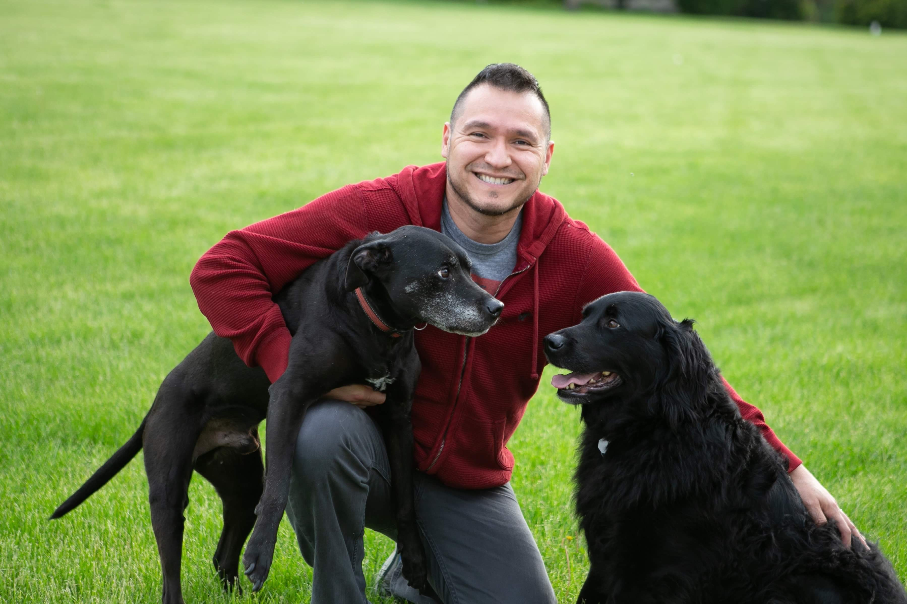

```{=html}
<div class="about-top" style="display: grid; grid-template-columns: 1fr 2fr; gap: 2rem; align-items: stretch; margin-bottom: 1.75rem;">
  <div class="about-photo-col">
    
  </div>
  <div class="about-intro-col">
    <p>I grew up on a farm in Venezuela. The part I remember most is called las rubieras — a stretch of land that stays impossibly green through the dry season, as if it's arguing with the sun. I didn't know then that I'd name a pottery studio after it, or that I'd spend most of my adult life trying to understand why people reach for metaphors when plain language would do just fine.</p>

    <p>I studied electrical engineering at Universidad Simón Bolívar, which tells you something about the kind of person I was at twenty — someone who believed the world could be described in circuits and systems. (It can, but only up to a point.) The pivot came when I moved to the United States and started teaching Spanish, first in rural Illinois and eventually at UW-Madison. Language stopped being something I used and became something I studied. I started my PhD in linguistics in my forties and defended in 2022, which felt late until I realized that's roughly when you have enough life to find idioms genuinely interesting.</p>
  </div>
</div>

<div class="about-body">
  <p>My dissertation was about idiomatic phrases — the kind where the words don't mean what they mean. <em>Kick the bucket. Estirar la pata.</em> What fascinated me was that listeners understand these without being explicitly told: something in the signal gives it away. That question hasn't entirely left me.</p>

  <p>These days I work as a Research Data Science Consultant at UW-Madison's Office of Research Cyberinfrastructure, helping researchers with the tools and strategies that make their work more reproducible, shareable, and visible. I also help run BRUG, a community of R users on campus. It turns out that teaching people to think about language and teaching people to think about data have more in common than you'd expect — both are about learning to ask better questions.</p>

  <p>The pottery started as a way to be in my body after too many hours at a desk. There's something clarifying about a material that doesn't negotiate — clay does what physics tells it to do. I also practice and teach Aikido in Janesville, which is another discipline built on the premise that force isn't always the answer.</p>

  <p>I'm a humanist. I believe in fairness, in access, and in the idea that good tools should be available to everyone willing to learn how to use them. I have a dog. I drink a lot of coffee. I speak Spanish natively and English as an L2 speaker, which means I notice things monolingual speakers miss — and occasionally miss things they'd catch immediately.</p>
</div>

<hr class="about-divider">
```

## Journal

::: {#journal-posts}
:::
