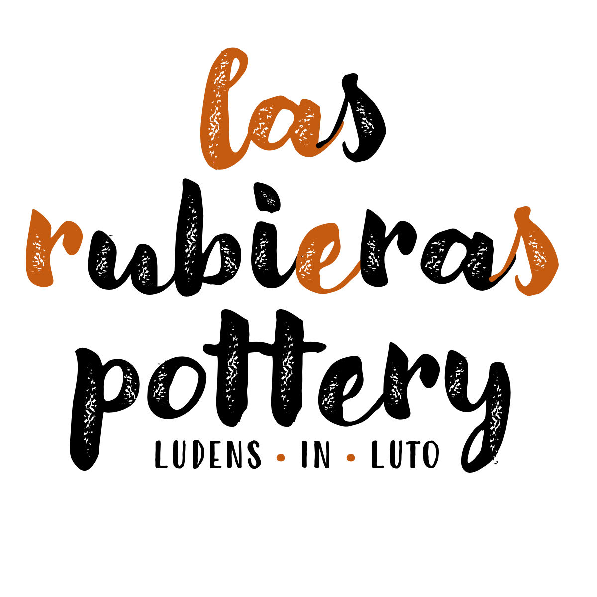
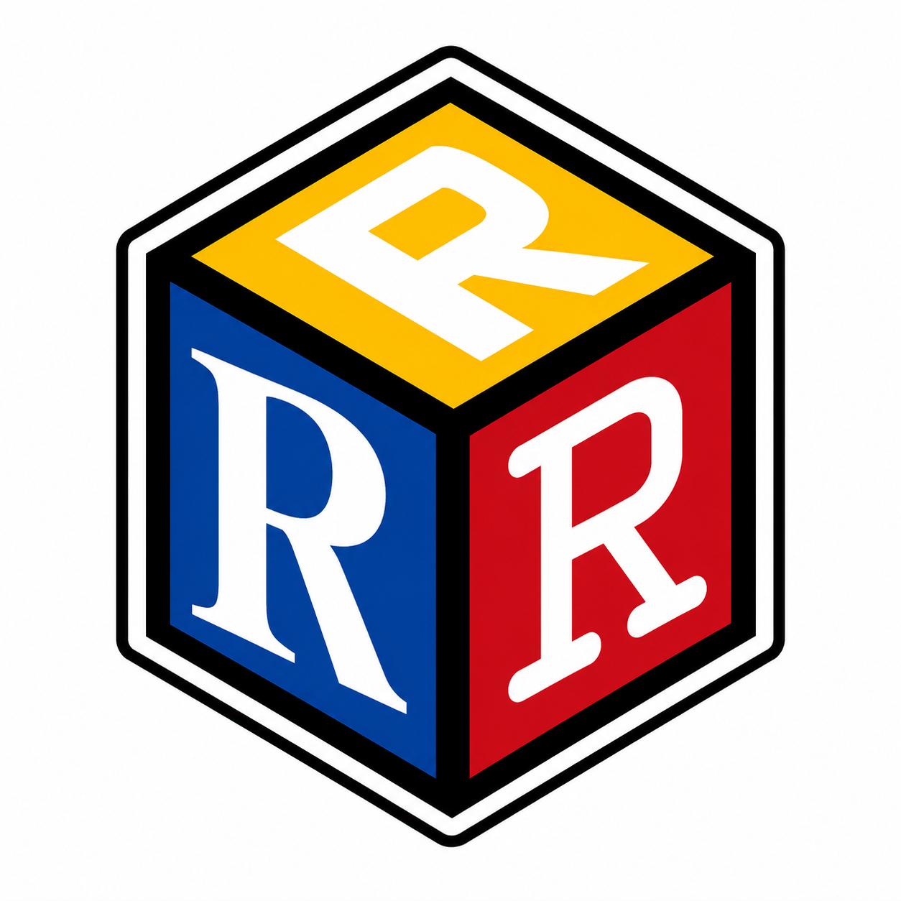

::: {.column-body}

## Hi, I'm Erwin

Language got me into academia and coffee keeps me there. I'm a linguist, a data scientist, a hobby potter, an aikidoist, and a dog dad. My Ph.D. dissertation was technically about idiomatic phrases — but really more about how we are able to capture nuances even when we are not consciously aware of them.

I work as a Research Data Science Consultant at UW-Madison and help run BRUG, a community of R users working to make research computing more accessible. I'm a humanist: I believe good tools should be in everyone's hands and that fairness matters in how we build them.

:::

```{=html}
<div class="cards-grid-outer">
  <div class="cards-grid">

    <div class="card card-day-job">
      <div class="card-inner">
        <div class="card-logo-panel">
          
        </div>
        <div class="card-vdivider"></div>
        <div class="card-text">
          <h3 class="card-title-text">Day Job</h3>
          <p class="card-desc-text">Research Data Science Consultant at UW-Madison. I work with researchers on the tools and strategies that make their work more reproducible, shareable, and visible.</p>
          <a href="day-job/" class="card-link-text">Learn more →</a>
        </div>
      </div>
    </div>

    <div class="card card-pottery">
      <div class="card-inner">
        <div class="card-logo-panel">
          
        </div>
        <div class="card-vdivider"></div>
        <div class="card-text">
          <h3 class="card-title-text">las rubieras pottery</h3>
          <p class="card-desc-text">las rubieras pottery is functional stoneware made to be held. The name comes from a lush corner of a Venezuelan farm — green against the dry season sun, almost like a mirage.</p>
          <a href="https://lasrubieraspottery.com" class="card-link-text">Visit the study →</a>
        </div>
      </div>
    </div>

    <div class="card card-aikido">
      <div class="card-inner">
        <div class="card-logo-panel">
          
        </div>
        <div class="card-vdivider"></div>
        <div class="card-text">
          <h3 class="card-title-text">Capital Aikikai of Wisconsin</h3>
          <p class="card-desc-text">CAoW is a dojo dedicated to the practice and promotion of the Japanese Martial Art of Aikido. We are a 501.c3 non-profit organization affiliated with [Capital Aikido Federation](https://capitalaikido.org/).</p>
          <a href="https://aikidoofwisconsin.com" class="card-link-text">Visit the dojo →</a>
        </div>
      </div>
    </div>

    <div class="card card-brug">
      <div class="card-inner">
        <div class="card-logo-panel">
          
        </div>
        <div class="card-vdivider"></div>
        <div class="card-text">
          <h3 class="card-title-text">BRUG</h3>
          <p class="card-desc-text">The Badger R User Group — a community of practice for researchers who code in R at UW-Madison.</p>
          <a href="brug/" class="card-link-text">Visit BRUG →</a>
        </div>
      </div>
    </div>

  </div>
</div>
```
