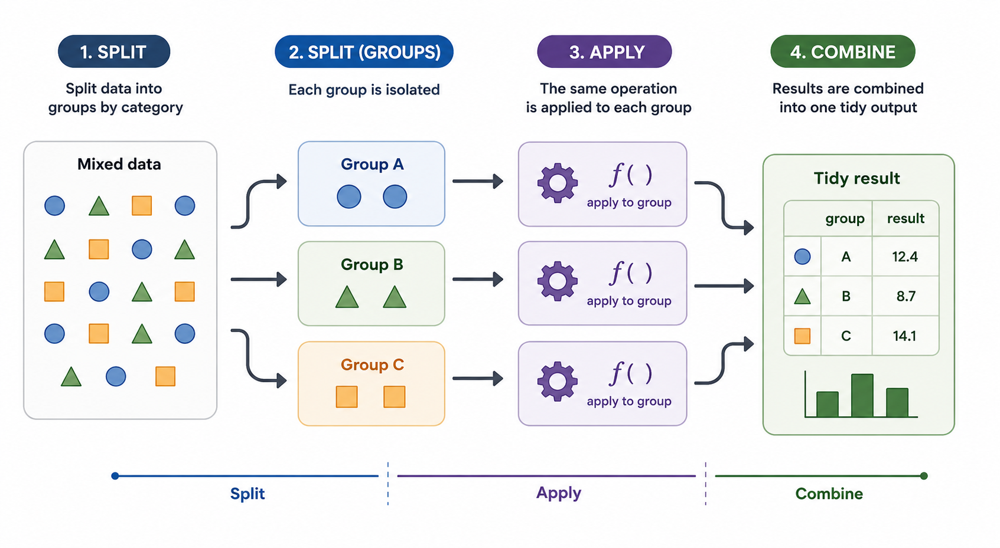

```{r}
#| label: setup
#| include: false
#| eval: true

library(readr)
library(dplyr)
library(ggplot2)
library(toolero)
library(tictoc)
library(gt)
library(stringr)
library(purrr)
library(tibble)
library(future)
library(furrr)
```

## The problem: one analysis, multiple datasets

Many research workflows require the same analysis to be repeated across subsets of a larger dataset. We may want to summarize measurements within subsets defined by species, treatment group, geography, or any other grouping variable. In this post, I use the Palmer Penguins dataset to walk through several ways to express this split-apply-combine pattern: split the data into groups, apply the same analysis to each group, and combine the results into a single output.



The examples start with deliberately explicit code, then move through progressively more abstract approaches: for loops, `across()`, `group_modify()`, `map()`, and finally `future_map()`. Each approach solves the same basic problem, but each emphasizes a different way of thinking about repeated work. The goal is not to argue that every approach is equally appropriate for this particular summary table. Instead, the goal is to show how the same analysis can be reorganized as the workflow becomes more complex, more reusable, or better suited to parallel execution.

The last part of the post explores how to take advantage of the multiple cores available on modern computers. Parallel execution is not always faster, especially for small examples, but the programming pattern is useful when the same analysis must be repeated across many files, groups, simulations, or model-fitting tasks.

## Input resolution

This function — from toolero, a package developed at RCI for managing execution context across environments — allows one codebase to resolve input files differently depending on how the code is being run. That is useful for avoiding code drift between interactive development, report rendering, and command-line execution.

The logic is straightforward. When you call `detect_execution_context()`, it returns one of three values: `interactive`, `quarto`, or `rscript`. Knowing the execution context lets the script decide where the input path should come from. In interactive mode, the path can be hardcoded for local development. During Quarto rendering, the path can come from a document parameter. When the code runs from the command line with `Rscript`, the path can come from a positional command-line argument.

```{r}
#| label: input-resolution
#| include: true
#| message: false
#| eval: true
#| warning: false

# detect_execution_context() identifies which of three environments this
# code is running in: interactive RStudio, quarto render, or Rscript.
# Each context resolves the input file path differently.
#
#   interactive : you are running chunks in RStudio -- path is hardcoded
#                 to the local data file for development convenience
#   quarto      : document is being rendered -- path comes from params
#                 defined in the YAML header above
#   rscript     : document is running on a remote cluster -- path comes
#                 from the first command line argument

context <- detect_execution_context()

input_file <- switch(context,
  interactive = "palmerpenguins.csv",
  quarto      = params$input_file,
  rscript     = commandArgs(trailingOnly = TRUE)[1]
)

penguins <- read_csv(input_file)
```

## Tabular results per species

I do not want the analysis itself to distract from the process I want to showcase. For this post, I limit the analysis to a set of descriptive statistics applied to the Palmer Penguins dataset. In short, we want to understand how several body measurements are distributed across species. This gives us a compact example that is simple enough to follow, but rich enough to demonstrate several ways of applying the same analysis to multiple subsets.

The summary statistics include measures of central tendency, range, spread, and selected quantiles for four measurement variables: body mass, flipper length, bill length, and bill depth.

## Approach 1: Explicit summaries

The first approach writes every calculation separately. This is a deliberately explicit implementation. It is readable in the sense that every output column is spelled out, but it is also verbose, repetitive, easy to mistype, and difficult to maintain as the number of variables or summary functions grows.

```{r}
#| label: explicit-summary
#| eval: true
#| message: false
#| include: true

tic("Explicit code")

p_stats <- penguins |>
  group_by(species) |>
  summarize(
    n            = n(),
    mean_mass    = mean(body_mass_g, na.rm = TRUE),
    mean_flipper = mean(flipper_length_mm, na.rm = TRUE),
    mean_bill_length = mean(bill_length_mm, na.rm = TRUE),
    mean_bill_depth = mean(bill_depth_mm, na.rm = TRUE),
    min_mass    = min(body_mass_g, na.rm = TRUE),
    min_flipper = min(flipper_length_mm, na.rm = TRUE),
    min_bill_length = min(bill_length_mm, na.rm = TRUE),
    min_bill_depth = min(bill_depth_mm, na.rm = TRUE),
    max_mass    = max(body_mass_g, na.rm = TRUE),
    max_flipper = max(flipper_length_mm, na.rm = TRUE),
    max_bill_length = max(bill_length_mm, na.rm = TRUE),
    max_bill_depth = max(bill_depth_mm, na.rm = TRUE),
    sd_mass    = sd(body_mass_g, na.rm = TRUE),
    sd_flipper = sd(flipper_length_mm, na.rm = TRUE),
    sd_bill_length = sd(bill_length_mm, na.rm = TRUE),
    sd_bill_depth = sd(bill_depth_mm, na.rm = TRUE),
    var_mass    = var(body_mass_g, na.rm = TRUE),
    var_flipper = var(flipper_length_mm, na.rm = TRUE),
    var_bill_length = var(bill_length_mm, na.rm = TRUE),
    var_bill_depth = var(bill_depth_mm, na.rm = TRUE),
    length_mass    = length(body_mass_g),
    length_flipper = length(flipper_length_mm),
    length_bill_length = length(bill_length_mm),
    length_bill_depth = length(bill_depth_mm),
    quantile_mass_25    = unname(quantile(body_mass_g, 0.25, na.rm = TRUE)),
    quantile_flipper_25 = unname(quantile(flipper_length_mm, 0.25, na.rm = TRUE)),
    quantile_bill_length_25 = unname(quantile(bill_length_mm, 0.25, na.rm = TRUE)),
    quantile_bill_depth_25 = unname(quantile(bill_depth_mm, 0.25, na.rm = TRUE)),
    quantile_mass_75    = unname(quantile(body_mass_g, 0.75, na.rm = TRUE)),
    quantile_flipper_75 = unname(quantile(flipper_length_mm, 0.75, na.rm = TRUE)),
    quantile_bill_length_75 = unname(quantile(bill_length_mm, 0.75, na.rm = TRUE)),
    quantile_bill_depth_75 = unname(quantile(bill_depth_mm, 0.75, na.rm = TRUE)),
    iqr_mass    = IQR(body_mass_g, na.rm = TRUE),
    iqr_flipper = IQR(flipper_length_mm, na.rm = TRUE),
    iqr_bill_length = IQR(bill_length_mm, na.rm = TRUE),
    iqr_bill_depth = IQR(bill_depth_mm, na.rm = TRUE)
  )

end_time <- toc()
```

The resulting tibble is wide, so the rendered table shows only part of the output at a time.

```{r}
#| include: true
#| eval: true

p_stats |>
  gt() |>
  fmt_number(
    columns = where(is.numeric),
    decimals = 2,
    use_seps = TRUE
  )
```

The word "explicit" should not be read as a criticism. Explicit code has real value — it is maximally transparent, and in a teaching context that transparency is the point. The weakness is that explicit code does not scale well. Once you add more variables or more summary functions, the code becomes harder to maintain and easier to break.

On my 2024 MacBook Pro, for the extended Penguin dataset consisting of `r prettyNum(nrow(penguins), big.mark = ",")` rows and `r ncol(penguins)` columns, the explicit approach took approximately 2.019 seconds to run.

## Approach 2: For loops

For loops make the repeated structure of the task visible. Rather than asking `dplyr` to perform the repetition for us, we can write the repetition ourselves. This is not necessarily the most concise or idiomatic way to solve the problem in R, but it is useful for understanding what grouped summaries are doing: they repeat the same operation over smaller pieces of a larger dataset.

### Approach 2.1: Looping over species

A loop over species makes the grouping logic explicit. For each species, we filter the data, compute one row of summaries, store that row in a list, and then bind the results together.

```{r}
#| label: loop-over-species
#| eval: true
#| message: false
#| include: true

tic("for loop for species")

species_values <- unique(penguins$species)

results <- vector("list", length(species_values))

for (i in seq_along(species_values)) {
  species_i <- species_values[[i]]

  data_i <- penguins |>
    filter(species == species_i)

  results[[i]] <- tibble(
    species = species_i,
    n = nrow(data_i),

    mean_mass = mean(data_i$body_mass_g, na.rm = TRUE),
    mean_flipper = mean(data_i$flipper_length_mm, na.rm = TRUE),
    mean_bill_length = mean(data_i$bill_length_mm, na.rm = TRUE),
    mean_bill_depth = mean(data_i$bill_depth_mm, na.rm = TRUE),

    min_mass = min(data_i$body_mass_g, na.rm = TRUE),
    min_flipper = min(data_i$flipper_length_mm, na.rm = TRUE),
    min_bill_length = min(data_i$bill_length_mm, na.rm = TRUE),
    min_bill_depth = min(data_i$bill_depth_mm, na.rm = TRUE),

    max_mass = max(data_i$body_mass_g, na.rm = TRUE),
    max_flipper = max(data_i$flipper_length_mm, na.rm = TRUE),
    max_bill_length = max(data_i$bill_length_mm, na.rm = TRUE),
    max_bill_depth = max(data_i$bill_depth_mm, na.rm = TRUE),

    sd_mass = sd(data_i$body_mass_g, na.rm = TRUE),
    sd_flipper = sd(data_i$flipper_length_mm, na.rm = TRUE),
    sd_bill_length = sd(data_i$bill_length_mm, na.rm = TRUE),
    sd_bill_depth = sd(data_i$bill_depth_mm, na.rm = TRUE),

    var_mass = var(data_i$body_mass_g, na.rm = TRUE),
    var_flipper = var(data_i$flipper_length_mm, na.rm = TRUE),
    var_bill_length = var(data_i$bill_length_mm, na.rm = TRUE),
    var_bill_depth = var(data_i$bill_depth_mm, na.rm = TRUE),

    length_mass = length(data_i$body_mass_g),
    length_flipper = length(data_i$flipper_length_mm),
    length_bill_length = length(data_i$bill_length_mm),
    length_bill_depth = length(data_i$bill_depth_mm),

    quantile_mass_25 = unname(quantile(data_i$body_mass_g, 0.25, na.rm = TRUE)),
    quantile_flipper_25 = unname(quantile(data_i$flipper_length_mm, 0.25, na.rm = TRUE)),
    quantile_bill_length_25 = unname(quantile(data_i$bill_length_mm, 0.25, na.rm = TRUE)),
    quantile_bill_depth_25 = unname(quantile(data_i$bill_depth_mm, 0.25, na.rm = TRUE)),

    quantile_mass_75 = unname(quantile(data_i$body_mass_g, 0.75, na.rm = TRUE)),
    quantile_flipper_75 = unname(quantile(data_i$flipper_length_mm, 0.75, na.rm = TRUE)),
    quantile_bill_length_75 = unname(quantile(data_i$bill_length_mm, 0.75, na.rm = TRUE)),
    quantile_bill_depth_75 = unname(quantile(data_i$bill_depth_mm, 0.75, na.rm = TRUE)),

    iqr_mass = IQR(data_i$body_mass_g, na.rm = TRUE),
    iqr_flipper = IQR(data_i$flipper_length_mm, na.rm = TRUE),
    iqr_bill_length = IQR(data_i$bill_length_mm, na.rm = TRUE),
    iqr_bill_depth = IQR(data_i$bill_depth_mm, na.rm = TRUE)
  )
}

p_stats <- bind_rows(results)

p_stats |>
  gt() |>
  fmt_number(
    columns = where(is.numeric),
    decimals = 2,
    use_seps = TRUE
  )

toc()
```

On my machine, the for loop over species took approximately 2.362 seconds.

### Approach 2.2: Looping over functions

A loop over functions abstracts a different dimension of the problem. Instead of writing `mean()`, `min()`, `max()`, `sd()`, and the other functions repeatedly by hand, we store the functions in a list and apply each one systematically. The grouping by species is still handled by `dplyr`.

```{r}
#| label: loop-over-functions
#| eval: true
#| message: false
#| include: true

tic("loop over functions")

summary_funs <- list(
  mean   = \(x) mean(x, na.rm = TRUE),
  min    = \(x) min(x, na.rm = TRUE),
  max    = \(x) max(x, na.rm = TRUE),
  sd     = \(x) sd(x, na.rm = TRUE),
  var    = \(x) var(x, na.rm = TRUE),
  length = \(x) length(x),
  q25    = \(x) unname(quantile(x, 0.25, na.rm = TRUE)),
  q75    = \(x) unname(quantile(x, 0.75, na.rm = TRUE)),
  iqr    = \(x) IQR(x, na.rm = TRUE)
)

measure_vars <- c(
  mass        = "body_mass_g",
  flipper    = "flipper_length_mm",
  bill_length = "bill_length_mm",
  bill_depth  = "bill_depth_mm"
)

p_stats <- penguins |>
  group_by(species) |>
  summarize(
    n = n(),
    .groups = "drop"
  )

for (fun_name in names(summary_funs)) {
  fun_i <- summary_funs[[fun_name]]

  stats_i <- penguins |>
    group_by(species) |>
    summarize(
      across(
        all_of(measure_vars),
        fun_i,
        .names = paste0(fun_name, "_{.col}")
      ),
      .groups = "drop"
    )

  p_stats <- p_stats |>
    left_join(stats_i, by = "species")
}

p_stats |>
  gt() |>
  fmt_number(
    columns = where(is.numeric),
    decimals = 2,
    use_seps = TRUE
  )

toc()
```

On my machine, the loop over functions took approximately 3.188 seconds.

### Approach 2.3: Looping over species, functions, and variables

The nested-loop version makes the full computational structure visible. For each species, for each summary function, and for each measurement variable, the code calculates one value and stores it in a named output column.

```{r}
#| label: loop-over-species-functions-variables
#| eval: true
#| message: false
#| include: true

tic("for loop over species and functions")

summary_funs <- list(
  mean   = \(x) mean(x, na.rm = TRUE),
  min    = \(x) min(x, na.rm = TRUE),
  max    = \(x) max(x, na.rm = TRUE),
  sd     = \(x) sd(x, na.rm = TRUE),
  var    = \(x) var(x, na.rm = TRUE),
  length = \(x) length(x),
  q25    = \(x) unname(quantile(x, 0.25, na.rm = TRUE)),
  q75    = \(x) unname(quantile(x, 0.75, na.rm = TRUE)),
  iqr    = \(x) IQR(x, na.rm = TRUE)
)

measure_vars <- c(
  mass        = "body_mass_g",
  flipper    = "flipper_length_mm",
  bill_length = "bill_length_mm",
  bill_depth  = "bill_depth_mm"
)

species_values <- unique(penguins$species)

results <- vector("list", length(species_values))

for (i in seq_along(species_values)) {
  species_i <- species_values[[i]]

  data_i <- penguins |>
    filter(species == species_i)

  row_i <- list(
    species = species_i,
    n = nrow(data_i)
  )

  for (fun_name in names(summary_funs)) {
    fun_i <- summary_funs[[fun_name]]

    for (var_label in names(measure_vars)) {
      var_name <- measure_vars[[var_label]]

      output_name <- paste(fun_name, var_label, sep = "_")

      row_i[[output_name]] <- fun_i(data_i[[var_name]])
    }
  }

  results[[i]] <- as_tibble(row_i)
}

p_stats <- bind_rows(results)

p_stats |>
  gt() |>
  fmt_number(
    columns = where(is.numeric),
    decimals = 2,
    use_seps = TRUE
  )

toc()
```

On my machine, the nested loop over species, functions, and variables took approximately 2.466 seconds.

The explicit approach emphasizes readability by spelling everything out. The for-loop approaches emphasize the repeated structure of the computation. Looping over species highlights the grouping logic, looping over functions highlights the reusable summary operations, and looping over species, functions, and variables exposes the full grid of operations being performed. For production code, however, these loop-based versions require more bookkeeping than necessary for a simple grouped summary.

## Approach 3: Declarative summaries with `across()`

The `across()` approach is the recommended default for this example because the desired output is a tibble of scalar summaries. Instead of listing every computation manually, we declare the measurement columns and the summary functions, then let `summarize()` generate the combinations. This version is shorter, easier to maintain, and easier to scale up than the explicit or loop-based alternatives.

```{r}
#| label: across-summary
#| eval: true
#| message: false
#| include: true

tic("`across` code")

p_stats <- penguins |>
  group_by(species) |>
  summarize(
    n = n(),
    across(
      .cols = c(
        body_mass_g,
        flipper_length_mm,
        bill_length_mm,
        bill_depth_mm
      ),
      .fns = list(
        mean = \(x) mean(x, na.rm = TRUE),
        min  = \(x) min(x, na.rm = TRUE),
        max  = \(x) max(x, na.rm = TRUE),
        sd   = \(x) sd(x, na.rm = TRUE),
        var  = \(x) var(x, na.rm = TRUE),
        length = \(x) length(x),
        q25  = \(x) unname(quantile(x, 0.25, na.rm = TRUE)),
        q75  = \(x) unname(quantile(x, 0.75, na.rm = TRUE)),
        iqr  = \(x) IQR(x, na.rm = TRUE)
      ),
      .names = "{.fn}_{.col}"
    ),
    .groups = "drop"
  )

p_stats |>
  gt() |>
  fmt_number(
    columns = where(is.numeric),
    decimals = 2,
    use_seps = TRUE
  )

toc()
```

On my machine, for the extended Penguin dataset consisting of `r prettyNum(nrow(penguins), big.mark = ",")` rows and `r ncol(penguins)` columns, the declarative `across()` approach took approximately 2.059 seconds to run. In this run, it was fractionally slower than the fully explicit version, but it is easier to read, easier to maintain, and easier to extend. Adding or removing a calculation requires changing the function list, not rewriting the entire summary.

## Approach 4: Per-group data-frame workflows with `group_modify()`

After writing the summaries explicitly and then refactoring them with `across()`, we can take one more step toward a reusable split-apply-combine workflow with `group_modify()`. The explicit version lists every calculation one by one, while the `across()` version declares a set of columns and a set of functions to apply inside `summarize()`. `group_modify()` shifts the focus from applying functions across columns to applying a function across groups.

For each group, `dplyr` passes two objects to the function: `.x`, the subset of rows for that group, and `.y`, a one-row tibble containing the group key. Because the function must return a data frame, `group_modify()` is best suited for cases where each group needs a custom "data frame in, data frame out" analysis that is more involved than a standard `summarize()` call.

```{r}
#| label: group-modify-summary
#| eval: true
#| message: false
#| include: true

tic("Group modify approach")

summary_funs <- list(
  mean   = \(x) mean(x, na.rm = TRUE),
  min    = \(x) min(x, na.rm = TRUE),
  max    = \(x) max(x, na.rm = TRUE),
  sd     = \(x) sd(x, na.rm = TRUE),
  var    = \(x) var(x, na.rm = TRUE),
  length = \(x) length(x),
  q25    = \(x) quantile(x, 0.25, na.rm = TRUE),
  q75    = \(x) quantile(x, 0.75, na.rm = TRUE),
  iqr    = \(x) IQR(x, na.rm = TRUE)
)

measure_vars <- c(
  "body_mass_g",
  "flipper_length_mm",
  "bill_length_mm",
  "bill_depth_mm"
)

summarize_one_species <- function(data) {
  data |>
    dplyr::summarize(
      n = dplyr::n(),
      dplyr::across(
        dplyr::all_of(measure_vars),
        summary_funs,
        .names = "{.fn}_{.col}"
      ),
      .groups = "drop"
    )
}

p_stats <- penguins |>
  dplyr::group_by(species) |>
  dplyr::group_modify(\(.x, .y) {
    summarize_one_species(.x)
  }) |>
  dplyr::ungroup()

p_stats |>
  gt() |>
  fmt_number(
    columns = where(is.numeric),
    decimals = 2,
    use_seps = TRUE
  )

toc()
```

On my machine, the `group_modify()` approach took approximately 2.262 seconds for the same dataset. In this example, it is slower than the simpler `across()` approach, and it does not provide much practical benefit because the output is still a straightforward summary table.

The reason to consider `group_modify()` is not speed. The main motivation is flexibility. `summarize()` is best suited for reducing each group to one row of scalar summaries. When each group needs to return a more complex data frame, `group_modify()` becomes a better fit. As a rule of thumb, use `group_modify()` when each group needs to go through a custom mini-pipeline and return a data frame.

## Approach 5: Split-apply-combine workflows with `map()`

The fifth approach uses `map()` to make the split-apply-combine pattern explicit. Instead of asking `dplyr` to keep the grouped workflow intact, we first split the data into separate pieces and then apply the same analysis function to each piece. In this example, each species becomes its own small data frame, and the same summary function is applied to each species-level subset.

This approach is more general than the previous ones, but it is not the most direct tool for this particular summary task. If all we need is one summary table with one row per species, `group_by()` plus `summarize()` plus `across()` is clearer and more idiomatic. Here, the purpose of introducing `map()` is not to make the code shorter. The purpose is to show a workflow pattern that becomes useful when each subset should be treated as an independent unit of analysis.

The structure of the workflow is:

1. Define a function that analyzes one subset of the data.
2. Split the larger dataset into smaller pieces.
3. Apply the function to each piece.
4. Combine the results.

```{r}
#| label: map-summary
#| eval: true
#| message: false
#| include: true

tic("using map")

summary_funs <- list(
  mean   = \(x) mean(x, na.rm = TRUE),
  min    = \(x) min(x, na.rm = TRUE),
  max    = \(x) max(x, na.rm = TRUE),
  sd     = \(x) sd(x, na.rm = TRUE),
  var    = \(x) var(x, na.rm = TRUE),
  length = \(x) length(x),
  q25    = \(x) quantile(x, 0.25, na.rm = TRUE),
  q75    = \(x) quantile(x, 0.75, na.rm = TRUE),
  iqr    = \(x) IQR(x, na.rm = TRUE)
)

measure_vars <- c(
  "body_mass_g",
  "flipper_length_mm",
  "bill_length_mm",
  "bill_depth_mm"
)

summarize_one_species <- function(data) {
  species_name <- unique(data$species)

  data |>
    summarize(
      n = n(),
      across(
        all_of(measure_vars),
        summary_funs,
        .names = "{.fn}_{.col}"
      ),
      .groups = "drop"
    ) |>
    mutate(species = species_name, .before = 1)
}

p_stats <- penguins |>
  group_split(species) |>
  map_dfr(
    summarize_one_species
  )

p_stats |>
  gt() |>
  fmt_number(
    columns = where(is.numeric),
    decimals = 2,
    use_seps = TRUE
  )

toc()
```

On my machine, using `map()` took approximately 14% longer than the explicit approach for this summary task. That result is not surprising. For simple grouped summaries, `map()` adds machinery that `dplyr` does not need. The value of this approach appears when the per-subset analysis becomes more substantial than a scalar summary table.

## Why bother with `map()`?

The strongest case for `map()` is that it lets us abstract an analysis. We can write one function that knows how to analyze one input, test that function on a single subset, and then apply it to many inputs. This separation between the analysis logic and the iteration logic makes the workflow easier to test, debug, and reuse.

This abstraction matters when the output is more complex than a tibble of scalar summaries. Each subset might produce a model, a plot, a diagnostic table, a saved file, or a list of related outputs. Those outputs do not always fit neatly inside a single `summarize()` call, but they fit naturally into a `map()` workflow because `map()` can return lists or list-columns.

The same pattern also works well for file-based workflows. Instead of splitting one data frame into groups, we might start with a vector of file paths. Each file path can be mapped to a function that reads the file, analyzes it, and returns or saves the result. That pattern closely resembles how batch jobs and cluster workflows are often organized: one input, one analysis, one output.

Finally, `map()` prepares the code for parallel execution. Once the workflow is organized as "one input, one function, one result," moving from `map()` to `furrr::future_map()` is a relatively small conceptual step. That makes `map()` a useful bridge from local sequential work to local multicore work.

## Approach 6: Parallel split-apply-combine with `future_map()`

The final approach uses the `future` and `furrr` packages to run the split-apply-combine workflow in parallel. The refactor is conceptually simple: define a function that summarizes one subset, split the data into subsets, and use `future_map_dfr()` to apply the function across those subsets.

Using multiple cores means allowing more than one R process to work at the same time. In a regular `map()` workflow, each subset is processed sequentially: R finishes the first subset, then moves to the second, then the third, and so on. In a `future_map()` workflow, those subset-level tasks can be distributed across multiple workers. A worker is an independent R session that can carry out one piece of the computation.

The number of workers should be chosen intentionally. More workers does not automatically mean faster code. Each worker has startup costs, memory costs, and communication costs. R may need to launch separate sessions, copy data and functions to those sessions, and collect the results when the jobs finish. If the individual jobs are small, that overhead can dominate the actual computation.

For this example, the unit of work is the species-level subset. Because the Palmer Penguins data have three species, we effectively have three independent jobs: one for Adelie, one for Chinstrap, and one for Gentoo. Using three workers matches the structure of the problem naturally. Each worker can take one species-level subset, run the same summary function, and return the result.

```{r}
#| label: future-map-summary
#| eval: true
#| message: false
#| include: true

tic("using future apply")

old_plan <- future::plan()
on.exit(future::plan(old_plan), add = TRUE)

future::plan(future::multisession, workers = 3)

summary_funs <- list(
  mean   = \(x) mean(x, na.rm = TRUE),
  min    = \(x) min(x, na.rm = TRUE),
  max    = \(x) max(x, na.rm = TRUE),
  sd     = \(x) sd(x, na.rm = TRUE),
  var    = \(x) var(x, na.rm = TRUE),
  length = \(x) length(x),
  q25    = \(x) quantile(x, 0.25, na.rm = TRUE),
  q75    = \(x) quantile(x, 0.75, na.rm = TRUE),
  iqr    = \(x) IQR(x, na.rm = TRUE)
)

measure_vars <- c(
  "body_mass_g",
  "flipper_length_mm",
  "bill_length_mm",
  "bill_depth_mm"
)

summarize_one_species <- function(data) {
  species_name <- unique(data$species)

  data |>
    summarize(
      n = n(),
      across(
        all_of(measure_vars),
        summary_funs,
        .names = "{.fn}_{.col}"
      ),
      .groups = "drop"
    ) |>
    mutate(species = species_name, .before = 1)
}

p_stats <- penguins |>
  group_split(species) |>
  future_map_dfr(
    summarize_one_species,
    .options = furrr_options(seed = TRUE)
  )

toc()
```

On my machine, using three workers took approximately 6.4 seconds. By contrast, using nine workers did not make the job faster. In fact, the same task took approximately 9.468 seconds with nine workers. That result is a useful reminder that parallel execution is not just about using as many cores as possible. The number of workers should reflect the number of independent tasks, the size of those tasks, and the overhead required to coordinate them.

For this exact summary task, the data are small enough and the per-species calculations are short enough that parallelization is not necessarily faster than the non-parallel approaches. The pattern is still useful because it is the same pattern you would use for larger workflows that train models, run simulations, process many files, or execute longer analyses independently across data chunks.

When moving from `map()` to `future_map()`, the line-level change is small, but the surrounding execution environment matters. You need a future plan, a deliberate number of workers, a strategy for random-number generation if the analysis uses randomness, and enough care to avoid moving unnecessarily large objects to each worker. In this example, `furrr_options(seed = TRUE)` is included to make random-number generation parallel-safe if randomness is introduced later.

## Timing summary

The table below collects the wall-clock times for each approach on the same dataset. These numbers are illustrative and machine-specific. All measurements were taken on a 2024 MacBook Pro with an M4 chip, 48GB of memory, running macOS Tahoe 26.5. Your results will differ, but the relative ordering is likely to be informative regardless of hardware.

```{r}
#| label: timing-summary
#| eval: true
#| include: true
#| echo: false

timing_data <- tribble(
  ~Approach,                                    ~Time_s, ~Delta_s, ~Delta_pct, ~Best_for,
  "1: Explicit summaries",                        2.019,     0.000,      0.00,  "Teaching and one-off analyses where every calculation should be visible and nothing is hidden behind abstraction. Easy to read, hard to maintain at scale.",
  "2: For loops",                                 2.362,     0.343,     17.00,  "Demonstrating what grouped summaries are doing under the hood. Useful for building intuition about iteration, less useful for production code.",
  "3: Declarative summaries with across()",       2.059,     0.040,      1.98,  "The recommended default for grouped scalar summaries. Compact, maintainable, and idiomatic. Adding or removing a statistic requires editing a list, not rewriting a block.",
  "4: Per-group workflows with group_modify()",   2.262,     0.243,     12.03,  "Cases where each group needs a custom mini-pipeline that returns a data frame more complex than a row of scalar summaries.",
  "5: Split-apply-combine with map()",            2.300,     0.281,     13.92,  "Workflows where each subset is an independent unit of analysis, especially when the output may be a model, a plot, a file, or a list rather than a flat tibble.",
  "6: Parallel execution with future_map()",      6.400,     4.381,    217.00,  "Large-scale workflows with many independent inputs: many files, many simulations, many model fits. Overhead dominates for small tasks like this one."
)

timing_data |>
  gt() |>
  cols_label(
    Approach   = "Approach",
    Time_s     = "Time (s)",
    Delta_s    = md("**\u00b1** vs Approach 1 (s)"),
    Delta_pct  = md("**\u00b1** vs Approach 1 (%)"),
    Best_for   = "Best suited for"
  ) |>
  fmt_number(
    columns = c(Time_s, Delta_s),
    decimals = 3
  ) |>
  fmt_number(
    columns = Delta_pct,
    decimals = 2
  ) |>
  tab_style(
    style = cell_text(color = "#9B0000"),
    locations = cells_body(
      columns = Delta_s,
      rows = Delta_s > 0
    )
  ) |>
  tab_footnote(
    footnote = "Measured on a 2024 MacBook Pro, M4 chip, 48GB RAM, macOS Tahoe 26.5. The future_map() time reflects 3-worker multisession overhead on a small dataset; for larger workloads the relationship inverts.",
    locations = cells_column_labels(columns = Time_s)
  ) |>
  cols_width(
    Approach  ~ px(220),
    Time_s    ~ px(80),
    Delta_s   ~ px(120),
    Delta_pct ~ px(120),
    Best_for  ~ px(340)
  )
```

The clearest takeaway from the timing data is that for this particular task — scalar grouped summaries on a moderately sized dataset — the differences among Approaches 1 through 4 are small enough to be practically irrelevant. The choice among them should be driven by readability and maintainability, not speed. The `map()` and `future_map()` approaches carry overhead that only pays off when the per-subset work is substantial enough to justify the cost of splitting, distributing, and collecting results.

## Recommended approach: knowing when to reach for which tool

The six approaches in this post converge on the same result, but they reflect meaningfully different assumptions about the shape of the problem. Before closing, it is worth being explicit about the decision point that separates them.

`across()` inside a `summarize()` call is the right tool when the goal is a flat tibble with one row per group and scalar values in every cell. This is the case for most descriptive summary tables: means, standard deviations, quantiles, counts. `dplyr` is optimized for exactly this pattern, and `across()` expresses it concisely. The return object is predictable — a tibble with a fixed shape that is easy to print, save, or pass downstream.

`map()` and `future_map()` are the right tools when that assumption breaks down. If each subset needs to return something other than a row of scalars — a fitted model, a diagnostic plot, a list of outputs, a saved file — then `summarize()` is no longer the right container, and `map()` steps in. The return object from a `map()` call is a list, which can hold anything: tibbles of different shapes, model objects, ggplot objects, or nested structures. That generality is precisely what makes `map()` more powerful and also slightly heavier than `across()`.

In other words, the decision point is the shape of the output. If each group produces one row, reach for `across()`. If each group produces something else — or something you are not sure about yet — reach for `map()`. And if those per-group tasks are large enough and independent enough that running them sequentially feels wasteful, reach for `future_map()` and let your laptop's cores share the load.

