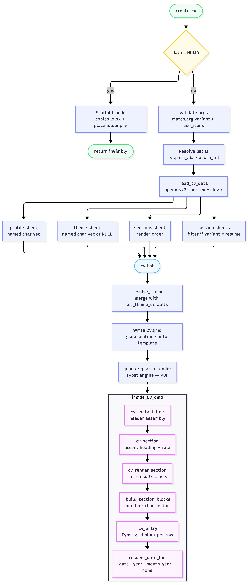

curriculr is an R package for building academic CVs and résumés from an Excel
workbook, rendered to PDF via Quarto's Typst engine. The core idea is simple:
you maintain your CV data in a structured `.xlsx` file, call `create_cv()`, and
get a typeset PDF back. The package handles all the intermediate steps —
reading and validating the workbook, resolving a visual theme, injecting
values into a Quarto template, and iterating over your data rows to emit raw
Typst markup.

## Package architecture

The pipeline has two distinct phases. The first phase runs in your R session:
it reads and validates data, resolves theme values, and writes a filled-in
`CV.qmd` file by substituting sentinels in the package template. The second
phase runs in a Quarto subprocess: the rendered document calls back into
curriculr's exported rendering functions to emit raw Typst blocks row by row.



The dashed arrow from `quarto_render()` into the inner box is doing conceptual
work: those functions are not called directly from `create_cv()`. They run
inside the Quarto subprocess when `CV.qmd` executes its R chunks. The
connection is through the sentinel-substituted template, not a direct R call
chain.

---

## The two modes of `create_cv()`

### Scaffold mode

Scaffold mode is triggered by calling `create_cv()` with no arguments — that
is, when `data = NULL`. It is designed for first-time setup. No rendering takes
place.

What it does, step by step:

1. Resolves `getwd()` to an absolute path via `fs::path_abs()`.
2. Copies `inst/extdata/cv-data-template.xlsx` to the current working
   directory. If the file already exists and `overwrite = FALSE` (the
   default), it prints an informational message and skips the copy.
3. Copies `inst/extdata/placeholder.png` under the same logic.
4. Prints a three-step instruction list telling the user to fill in the
   workbook, replace the placeholder photo, and call `create_cv()` with
   `data` and `photo` arguments.
5. Returns the destination directory invisibly.

```r
# Scaffold mode — run from your project directory
create_cv()
#> ✔ Created /your/project/cv-data-template.xlsx
#> ✔ Created /your/project/placeholder.png
#> ℹ Next steps:
#>   1. Open cv-data-template.xlsx and fill in the profile sheet.
#>   2. Replace placeholder.png with your own profile photo.
#>   3. Call create_cv(data = 'cv-data-template.xlsx', photo = 'your-photo.png').
```

### Render mode

Render mode is triggered when a path is supplied to `data`. It runs the full
pipeline: read, resolve, write, render.

**Step 1 — Validate scalar arguments.** `variant` and `use_icons` are both
validated with `match.arg()` before anything else. Invalid values abort with a
clear error.

**Step 2 — Resolve and validate paths.** Both `data` and `photo` (if supplied)
are converted to absolute paths via `fs::path_abs()`. The photo's path
relative to the output directory is computed with `fs::path_rel()` — this is
what gets injected into the template, since the Quarto subprocess needs a
relative path to the image from the `.qmd` file's location. If `photo = NULL`,
`photo_rel` is set to an empty string and the template renders a single-column
header.

**Step 3 — Read the workbook.** `read_cv_data()` loads the workbook with
`openxlsx2`, applies per-sheet logic, filters section rows when
`variant = "resume"`, sorts dated sheets in reverse chronological order, and
returns a named list. See the [workbook schema](#the-workbook-schema) section
below for what each sheet must contain.

**Step 4 — Resolve the theme.** `.resolve_theme()` merges `cv$theme` (which is
`NULL` if the workbook has no `theme` sheet) with the twelve built-in defaults
from `.cv_theme_defaults()`. Any key present in the workbook overrides the
default; missing keys fall back silently.

**Step 5 — Write `CV.qmd`.** The package template at
`inst/templates/CV.qmd` is read into a string, then a series of `gsub()` calls
replace five sentinels:

| Sentinel | Replaced with |
|---|---|
| `__CURRICULR_DATA_PATH__` | Absolute path to the workbook |
| `__CURRICULR_PHOTO_PATH__` | Relative path to the photo, or `""` |
| `__CURRICULR_VARIANT__` | `"cv"` or `"resume"` |
| `%%CURRICULR_FORMAT%%` | YAML `format: typst:` block from `.build_format_block()` |
| `%%CURRICULR_THEME%%` | Raw `{=typst}` style block from `.build_typst_theme_block()` |

The filled-in `CV.qmd` is written to the same directory as the workbook.

**Step 6 — Render to PDF.** `quarto::quarto_render()` is called with
`output_format = "typst"`. The Quarto subprocess re-reads the workbook,
calls the rendering functions described below, and produces the final PDF.

```r
# Render mode — full CV with photo
create_cv(
  data  = "~/my_cv/cv-data.xlsx",
  photo = "~/my_cv/headshot.jpg"
)

# Résumé variant — only rows with include_in_resume checked
create_cv(
  data        = "~/my_cv/cv-data.xlsx",
  photo       = "~/my_cv/headshot.jpg",
  variant     = "resume",
  output_file = "resume.pdf"
)

# Plain-text contact line, no icons
create_cv(
  data      = "~/my_cv/cv-data.xlsx",
  use_icons = "none"
)
```

---

## The workbook schema

The workbook is the single source of truth for all CV content. It is an
`.xlsx` file with a fixed set of control sheets and any number of user-defined
section sheets.

**Control sheets** (reserved names, handled with special logic in
`read_cv_data()`):

- `profile` — two columns: `field` and `value`. Each row is one scalar:
  `first_name`, `last_name`, `email`, `website`, `github`, `linkedin`,
  `phone`, `address`, `profile_statement`. Returned as a named character
  vector.
- `sections` — the render-order manifest. Columns include `section` (matches
  the sheet name exactly), `label` (display heading), `title_col`, `org_col`,
  `detail_col`, `date_fun`, and `where_col`. Row order controls the order
  sections appear in the rendered CV.
- `theme` — two columns: `key` and `value`. Twelve recognized keys covering
  fonts, colors, page size, and margins. Optional — absent sheet triggers
  built-in defaults.
- `readme` — documentation sheet, skipped entirely by `read_cv_data()`.

**Section sheets** — one sheet per CV section (e.g. `education`,
`experience`, `publications`). Standard column spine:

| Column | Purpose |
|---|---|
| `title` | Main entry label |
| `unit` | Organization or venue |
| `startMonth` | Start month |
| `startYear` | Start year (used for reverse-chronological sort) |
| `endMonth` | End month (`"present"` supported) |
| `endYear` | End year |
| `where` | Location |
| `detail` | Additional context line |
| `include_in_resume` | Boolean — controls résumé filtering |

The `include_in_resume` column is consumed by `read_cv_data()` and dropped
before data reaches the rendering pipeline. New sections can be added
programmatically with `add_section()`.

---

## Inside `CV.qmd`: the rendering pipeline

Once Quarto launches the subprocess, the `.qmd` file runs four R chunks that
call back into curriculr's exported functions.

The **setup chunk** calls `read_cv_data()` again with the injected path and
variant, reconstituting the `cv` list inside the subprocess.

The **header chunk** calls `cv_contact_line()` to build the Typst-formatted
contact line, then emits a two-column photo/name/contact grid (when
`photo` is non-empty) or a single-column header (when it is). All profile
strings are passed through `typst_escape()` before being spliced into Typst.

The **sections chunk** iterates over the rows of `cv$sections` in order. For
each section it calls `cv_section()` to emit the heading, then
`cv_render_section()` to emit the entries. The column names and `date_fun`
token are read directly from `cv$sections`, so section-level formatting is
controlled entirely from the workbook.

### The builder/printer split

`cv_render_section()` is the printer: it calls `cat()` and returns
`invisible(NULL)`. It is not directly testable because its output goes to
stdout.

`.build_section_blocks()` is the builder: it does the real work — iterating
over rows, calling `.cv_entry()` for each one, returning a character vector of
Typst blocks. Because it returns a value rather than printing, it can be tested
directly with `testthat` without capturing stdout.

This pattern — builder builds, printer prints — is used consistently across
curriculr and `arborize`.

---

## Function reference

### Exported functions

**`create_cv(data, photo, output_file, overwrite, variant, use_icons)`**
The main entry point. Dispatches to scaffold mode when `data = NULL`, render
mode otherwise. In render mode it orchestrates the full pipeline: validate,
read, resolve theme, write template, render. Returns the destination directory
(scaffold) or PDF path (render) invisibly.

**`read_cv_data(path, variant)`**
Reads all sheets from a curriculr-formatted `.xlsx` workbook and returns a
named list. The `profile` and `theme` elements are named character vectors;
all section elements are data frames sorted in reverse chronological order by
`startYear`. The `include_in_resume` column is used for filtering when
`variant = "resume"` and is then dropped. The `readme` sheet is skipped
entirely.

**`add_section(workbook, section, label, date_fun, title_col, org_col, detail_col, where_col, overwrite)`**
Adds a new sheet to an existing workbook and registers it in the `sections`
control sheet. Writes the standard nine-column spine (`title`, `unit`,
`startMonth`, `startYear`, `endMonth`, `endYear`, `where`, `detail`,
`include_in_resume`) and adds a TRUE/FALSE dropdown validation on the
`include_in_resume` column. Modifies the workbook in place.

**`cv_contact_line(profile, use_icons)`**
Assembles the Typst-formatted contact line for the CV header. When
`use_icons = "fontawesome"`, known fields (`email`, `website`, `github`,
`linkedin`, `phone`) are rendered as `#fa-icon("...")` calls with their
display text. Unknown fields fall back to plain text with a warning. When
`use_icons = "none"`, all fields render as plain text separated by a middle
dot. `github` and `linkedin` values are expanded to full URLs regardless of
whether the workbook stores bare usernames or full URLs.

**`cv_section(title)`**
Emits a raw `{=typst}` code block for a section heading. The first letter is
rendered in the accent color; the remainder in the dark color. A horizontal
rule in a light gray fills the rest of the line, implemented as a two-column
`#grid` in Typst.

**`cv_render_section(data, title_col, org_col, detail_col, date_fun, where_col)`**
The printer half of the builder/printer split. Calls `.build_section_blocks()`
and passes the result to `cat()`. Intended to be called inside a Quarto chunk
with `results = "asis"`. Returns `invisible(NULL)`.

**`resolve_date_fun(token)`**
Maps a string token to a date-formatting function. Supported tokens:
`"date"` (full month+year range via `.cv_date_range()`), `"year"` (year range
via `.cv_year_range()`), `"month_year"` (start month and year only),
`"year_only"` (start year only), `"none"` (returns `NULL`, date omitted).
Unknown tokens emit a `cli_warn()` and return `NULL`.

**`typst_escape(x)`**
Escapes a character value for safe use in Typst markup. Strips HTML `<br>`
tags, collapses repeated whitespace, escapes the characters Typst treats as
markup (`#`, `$`, `%`, `&`, `~`, `_`, `^`, `{`, `}`, `[`, `]`, `@`), and
trims leading/trailing whitespace. The `@` is included because Typst
interprets bare email addresses as label references.

---

### Internal helpers

**`.resolve_theme(theme)`**
Merges a user-supplied theme vector (or `NULL`) with the twelve built-in
defaults from `.cv_theme_defaults()`. Any key present in the workbook theme
overrides the default; absent or empty keys are filled from defaults silently.
Returns a fully-populated named character vector with all twelve keys present.

**`.cv_theme_defaults()`**
Returns the twelve built-in theme defaults as a named character vector:
`font_family` (`"Lato"`), `font_size` (`"8.8pt"`), `body_color`, `line_leading`,
`accent_color` (`"#c5050c"` — Badger Red), `dark_color`, `bodygray_color`,
`lightgray_color`, `rulegray_color`, `papersize` (`"us-letter"`), `margin_x`,
`margin_y`.

**`.build_format_block(theme)`**
Constructs the `format: typst:` YAML block injected at the
`%%CURRICULR_FORMAT%%` sentinel. Pulls `papersize`, `margin_x`, and `margin_y`
from the resolved theme.

**`.build_typst_theme_block(theme, use_icons)`**
Constructs the raw `{=typst}` code block injected at the `%%CURRICULR_THEME%%`
sentinel. Sets `#set text()` and `#set par()` and defines five Typst color
variables (`accent`, `dark`, `bodygray`, `lightgray`, `rulegray`). When
`use_icons = "fontawesome"`, prepends the `#import "@preview/fontawesome:0.5.0": *`
line.

**`.build_section_blocks(data, title_col, org_col, detail_col, date_fun, where_col)`**
The builder half of the builder/printer split. Iterates over each row of
`data`, calling `.cv_entry()` for each one, and returns a character vector of
Typst grid blocks — one element per row. Testable without stdout capture.

**`.cv_entry(title, organization, detail, when, where)`**
Produces a single raw `{=typst}` block for one CV entry. Runs all five
arguments through `typst_escape()`, then emits a two-column `#grid`: left
column holds title (semibold, dark) and organization+detail (smaller, gray,
joined by an em dash); right column holds `when` and `where` (right-aligned,
accent color, stacked with a hard line break). Empty fields are dropped via
`nzchar()` so no blank lines or dangling em dashes appear.

**`.cv_date_range(row)`**
Formats a full date range from a one-row data frame using `startMonth`,
`startYear`, `endMonth`, and `endYear`. Handles the `"present"` sentinel
(case-insensitive) in `endMonth`. Called by `resolve_date_fun()` when token
is `"date"`.

**`.cv_year_range(row)`**
Formats a year-only range from `startYear` and `endYear`. Returns just the
start year when `endYear` is absent. Called by `resolve_date_fun()` when token
is `"year"`.

**`.cv_value(row, name, default)`**
Safely extracts a named value from a one-row data frame. Returns `default`
(empty string by default) when the column does not exist or the value is `NA`.
Used throughout `.cv_entry()` and the date helpers.

**`.fa_icon_map()`**
Returns a named character vector mapping profile field names to their Font
Awesome icon identifiers as used by the Typst `@preview/fontawesome` package.
Currently maps `email → "envelope"`, `website → "globe"`, `github → "github"`,
`linkedin → "linkedin"`, `phone → "phone"`.

**`.coerce_col(col)`**
Converts a column to character and normalizes the string `"NA"` (produced by
`as.character(NA)`) back to `NA_character_`. Applied to every column of every
sheet read by `read_cv_data()`.

**`%||%(x, y)`**
Null-coalescing operator. Returns `y` when `x` is `NULL`, zero-length, or
all-`NA`. Used throughout the rendering helpers to provide safe fallbacks.


## Sentinels and the null-coalescing operator

### Sentinels 

In curriculr, a sentinel is a placeholder string embedded in the `CV.qmd` template that `create_cv()` replaces at runtime with a real value using `gsub()`. They're essentially markup that the template itself can't know ahead of time — things that only become available when the user actually calls `create_cv()` with their specific paths, variant, and theme choices.

There are five of them:

- `__CURRICULR_DATA_PATH__` — replaced with the absolute path to the user's workbook
- `__CURRICULR_PHOTO_PATH__` — replaced with the relative path to the photo, or an empty string
- `__CURRICULR_VARIANT__` — replaced with `"cv"` or `"resume"`
- `%%CURRICULR_FORMAT%%` — replaced with the full `format: typst:` YAML block built from the resolved theme
- `%%CURRICULR_THEME%%` — replaced with the raw `{=typst}` style block that sets fonts, colors, and optionally imports the Font Awesome package

The two naming conventions (`__DOUBLE_UNDERSCORE__` vs `%%PERCENT_PERCENT%%`) are just a visual distinction between the two kinds of substitution: the underscore sentinels are scalar string values, while the percent sentinels are entire multi-line code blocks. It's not enforced anywhere — just a readability convention.

### The `%||%` null-coalescing operator 

That's `%||%`, the null-coalescing operator defined in `typst-helpers.R`. It's a pretty common R idiom — you'll find versions of it in rlang and several other packages — but curriculr defines its own rather than taking a dependency just for this.

The logic is:

```r
`%||%` <- function(x, y) {
    if (is.null(x) || length(x) == 0 || all(is.na(x))) y else x
}
```

So it returns `y` when `x` is `NULL`, zero-length, or entirely `NA` — and returns `x` otherwise. It's slightly more defensive than the rlang version, which only checks for `NULL`. The `all(is.na(x))` arm means it also catches columns that came back from Excel as a vector of `NA`s, which is a realistic edge case when a user leaves a field blank in the workbook.

In practice it shows up in `typst_escape()` and the date/value helpers as a safe fallback to an empty string, so that a missing profile field or an empty cell never causes a downstream error — it just silently becomes `""` and gets dropped by the `nzchar()` checks later in `.cv_entry()`.

## On passing raw output 

Here's an example of what the raw output passed on can look like. 

````
```{=typst}
#grid(
  columns: (1fr, 1.68in),
  gutter: 0.65em,
  [
    #text(size: 9.15pt, weight: "semibold", fill: dark)[PhD in Linguistics]
    #text(size: 8.25pt, fill: bodygray)[University of Wisconsin--Madison — Spanish Phonetics and Phonology]
  ],
  [#align(right)[#text(size: 8.1pt, fill: accent)[2018 - 2024\nMadison, WI]]]
)
#v(0.36em)
```
````

And a section heading looks like:

````
```{=typst}
#v(0.58em)
#grid(
  columns: (auto, 1fr),
  gutter: 0.65em,
  align: horizon,
  [#text(size: 13.8pt, weight: "regular", fill: dark)[#text(fill: accent)[E]ducation]],
  [#line(length: 100%, stroke: 0.55pt + rulegray)]
)
#v(0.20em)
```
````

---

As for the two design choices — they're actually solving the same underlying problem from different angles.

**`{=typst}` blocks** are Quarto's "raw passthrough" syntax. Wrapping content in ` ```{=typst} ` tells Quarto: don't touch this, don't interpret it as Markdown, just hand it directly to the Typst compiler as-is. Without that wrapper, Quarto would try to process the `#grid(...)` calls as Markdown and mangle them. It's the same idea as `{=html}` or `{=latex}` raw blocks — you're stepping outside Quarto's rendering layer entirely and speaking directly to the target format.

**`results = "asis"`** solves the R side of the same problem. Normally when an R chunk calls `cat()`, knitr wraps the output in a code block before passing it to Quarto. `results = "asis"` tells knitr to pass the output through verbatim, with no wrapping. So the chain is: `.cv_entry()` builds the string → `cat()` writes it → knitr passes it through raw → Quarto sees a `{=typst}` block → Typst compiles it. Remove either piece and the chain breaks — without `{=typst}` Quarto garbles the markup, without `results = "asis"` knitr wraps it in a fence and Quarto never sees raw Typst at all.

It's a clean stack once you see it, but it does require knowing which layer each piece belongs to.

## Using curriculr

Given how much machinery sits under the hood, it's worth stepping back and describing what actually happens when you use curriculr, day to day. The internals covered above are there to explain *why* the package behaves the way it does; using it, mercifully, requires knowing very little of that.

### The first time

The first time you touch curriculr, you're in scaffold mode, whether you realize it or not. You call `create_cv()` with no arguments, curriculr copies two files into the working directory, a template workbook and a placeholder image, and prints a short list of next steps. Nothing renders yet.

```r
library(curriculr)
create_cv()
```

Those two artifacts are the whole of curriculr's "installation" step, in a sense: an `.xlsx` workbook that will hold your CV content, and a stand-in photo you're meant to replace with your own. Open the workbook, fill in the `profile` sheet (name, email, a line about yourself), then work through the section sheets. It may not be unreasonable to think of this as the only time you'll look at R code before you have a working CV — the render itself needs just one more call:

```r
create_cv(
  data  = "cv-data-template.xlsx",
  photo = "your-photo.png"
)
```

That's render mode — the same read, resolve, write, render pipeline covered earlier — and it's the last time you need to think about R at all.

### Keeping it current

Recall that curriculr treats the workbook, not the R session, as the single source of truth. In other words: once the CV exists, "updating your CV" and "editing the spreadsheet" are the same action. There's no step where you write R code to add a job or a publication.

Say a new conference talk needs to go on the CV. You'd open the
`presentations` sheet, add one row — title, venue, dates, and whatever `include_in_resume` value you want — and save the file:

| title | unit | startMonth | startYear | endMonth | endYear | where | detail | include_in_resume |
|---|---|---|---|---|---|---|---|---|
| Reproducible CVs with curriculr | BRUG Meetup | July | 2026 | July | 2026 | Madison, WI | Lightning talk on the package's design | TRUE |

Then you rerun the same `create_cv()` call you used the first time, pointed at the same workbook:

```r
create_cv(
  data  = "cv-data-template.xlsx",
  photo = "your-photo.png"
)
```

curriculr rereads the whole workbook, resolves the theme, rewrites `CV.qmd`, and rerenders — the new entry lands wherever `startYear` places it, since sections sort in reverse-chronological order automatically. You don't reorder anything by hand, and you don't touch `CV.qmd` directly (it's regenerated fresh from the template every time, sentinels and all, so any manual edits to it wouldn't survive the next render anyway).

### The shape of it

Put the two paths together and the whole lifecycle looks like this:

{#fig-id width="500px" height="375px" fig-align="center" fig-alt="Descriptive text for screen readers"}

{width="px" height="375px"fig-alt="a diagram showcasing how to use curricular"}

Everything below "render mode" is the loop you'll actually live in: edit a row, rerun the same call, get a new PDF. The scaffolding step happens exactly once per CV.