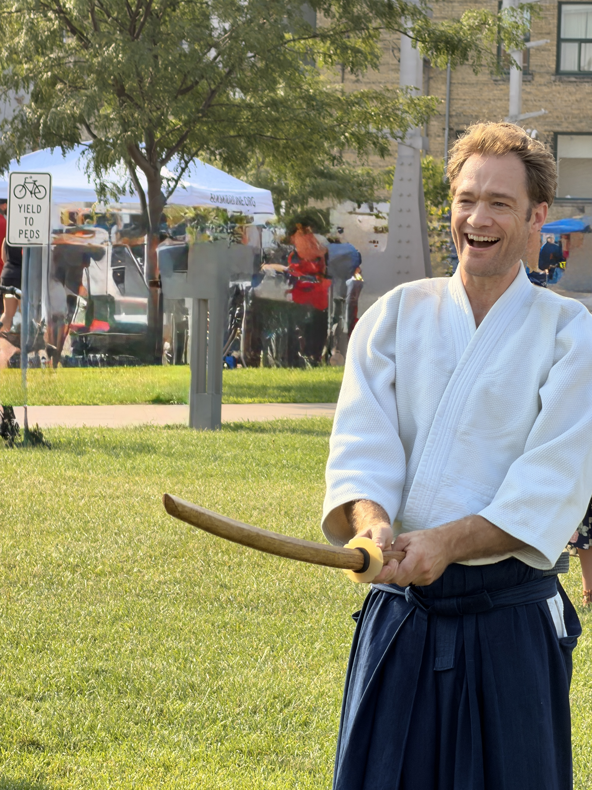
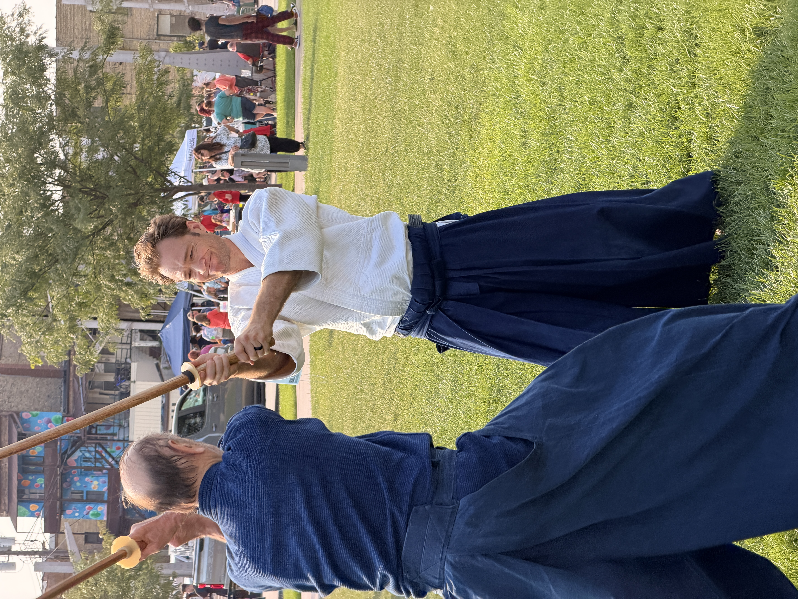
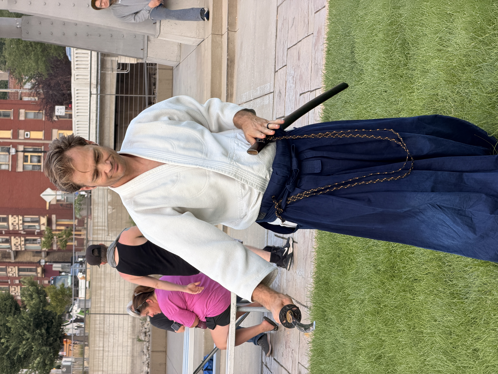
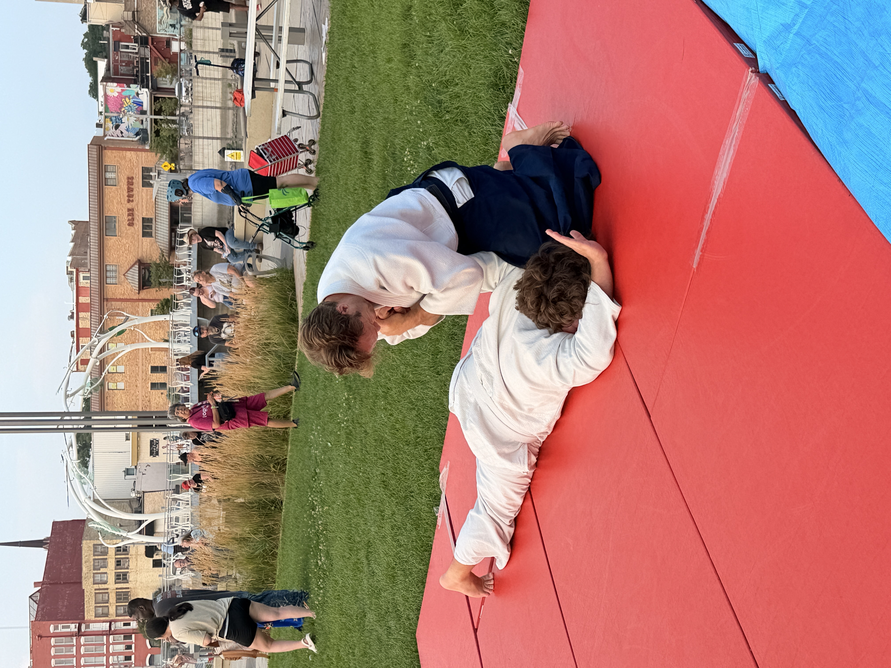
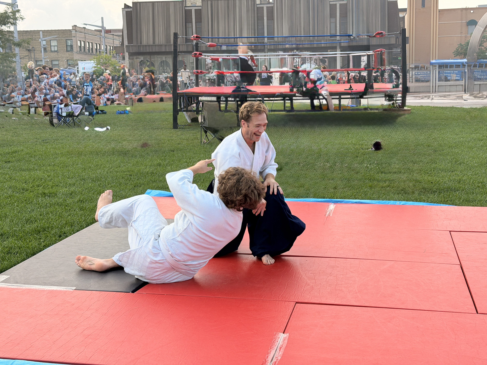
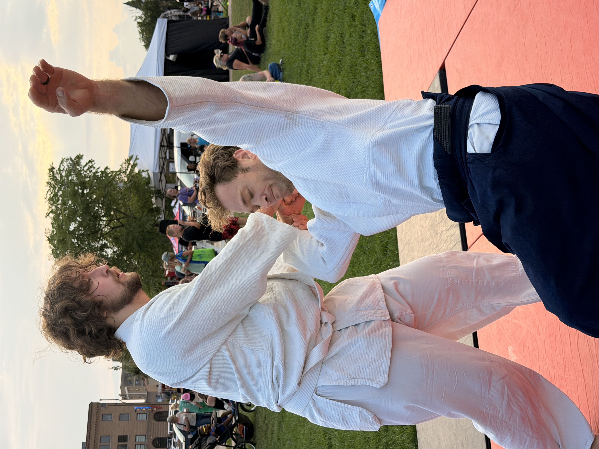

Yesterday, August 4, CAoW took part in the National Night Out event in Janesville. We shared the space with the Kurokata Kendo Club from Edgerton, which made for a nice pairing: two arts built around the sword, seen from very different angles.

Our setup was modest: eight mats, a table, and a bowl of candy for the curious visitors who wandered by. We alternated demonstrations with Kurokata, each running about five minutes, iaido then aikido, back and forth through the evening.

Rick and Scott handled the iaido side, and the crowd responded to it the way crowds usually do to gleaming swords and precise cuts. A couple of kids in particular seemed genuinely captivated by the movements.

Scott, Jackson, and I took turns on the aikido side. The ground was mostly flat, and we taped the mats down to keep them in place, but they still shifted underfoot more than we expected, and moving on that footing turned out to be harder than I'd anticipated. Scott and Jackson brought a lot of energy to it and made every throw look effortless, even with the terrain working against us.

The best part of the evening came near the end, when a small contingent of kids asked if they could step onto the mat. Jackson walked them through ukemi, and it wasn't long before all of them were rolling back and forth, delighted with themselves. Moments like that are a good reminder of why we do these events in the first place.

::: {.photo-grid}
{.lightbox group="post-slug"}
{.lightbox group="post-slug"}
{.lightbox group="post-slug"}
{.lightbox group="post-slug"}
{.lightbox group="post-slug"}
{.lightbox group="post-slug"}
:::
