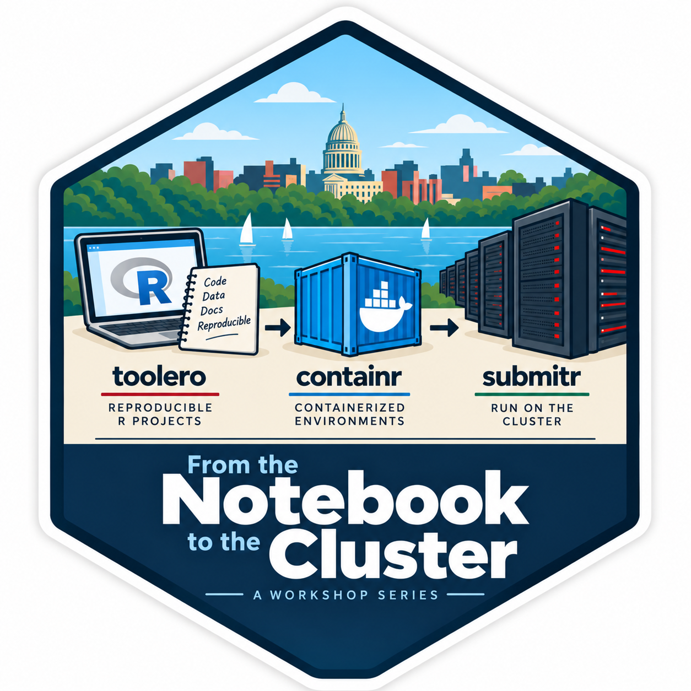

## Roadmap

Each session picks up where the last one left off, following one research project through its evolution:

```text
Local analysis
      │
      ▼
toolero    →   Build a reproducible project
      │
      ▼
containr   →   Encapsulate that project into a portable container
      │
      ▼
submitr    →   Run that container on CHTC
```



You will see this same project -- a real, if modest, analysis -- go from a folder of scripts on a laptop, to a well-organized and documented R project, to a container that runs identically on any Docker-compatible machine, to a job executing on CHTC and returning results. Each session solves a genuine problem that shows up somewhere in that arc, and each one hands you something you can keep using afterward.

## The three sessions

All three sessions run from 2:00 to 3:30 PM in CS 3139 (Computer Sciences Building), in person. You are welcome to attend all three in sequence, or to attend only the one that addresses the problem you have right now -- more on how that works below.

### Part 1 -- Starting Clean: Reproducible R Projects with `toolero`
**Wednesday, October 7 | from 2:00 — 3:30pm | CS 3139** 

The starting point is the mess nearly every research project accumulates: scripts that only run in a particular order, dependencies nobody wrote down, a folder structure that made sense six months ago and no longer does. This session works through that mess directly, then introduces `toolero` to resolve it -- reproducible project scaffolding, dependency management, and documentation practices that turn a personal working style into something someone else (including future you) can pick up and run. You will leave with `minimal-project`, a well-organized, reproducible R project that becomes the shared artifact for the rest of the series.

### Part 2 -- Portable Research: Containerizing R Projects with `containr`
**Wednesday, October 14 | from 2:00 — 3:30pm | CS 3139** 

A reproducible project on your laptop is still tied to your laptop. This session asks why `renv` alone is not enough to guarantee that an analysis runs the same way somewhere else, and introduces containers as the answer. Using `containr`, you will build a Dockerfile, build and run an image locally, and publish that image to a container registry. You will leave with a published container image for `minimal-project` that runs identically on any Docker-compatible machine.

### Part 3 -- Scaling Out: Running Containerized R Projects on CHTC with `submitr`
**Wednesday, October 22 | from 2:00 — 3:30pm | CS 3139** 

A portable container is ready to run anywhere -- including, at last, on CHTC. This session covers what a containerized project needs to run as an HTCondor job: preparing and uploading the required assets, submitting the job with `submitr`, and retrieving results. You will leave with a working submission file, executable, and a completed CHTC job for `minimal-project`, along with the workflow to do the same for your own research.

## Come to one, come to all

The series tells one continuous story, but you do not need to attend every session to get value out of one. Each session works toward a shared hands-on task, and if you do not finish yours in the time available, I will have a completed version of that session's artifact ready so you leave with something real either way:

- **`toolero`:** a finished `minimal-project.qmd` and its sample data, `data/penguins.csv`
- **`containr`:** a finished Dockerfile, a built image, and that image published to a container registry
- **`submitr`:** a finished `.sub` submission file, a `.sh` executable file, a submitted job, and its results

That means if you can only make it to the `containr` session, you will start from a working reproducible project (yours if you attended Part 1, mine if you did not) rather than getting stuck before the session's real content even begins.

## Who this is for

This series is aimed at researchers on campus who already write R code comfortably and intend to eventually run work on CHTC, but who have little or no experience with `renv`, containers, Docker, HTCondor, or CHTC workflows themselves. If that describes where you are, you are the intended audience -- this is deliberately not a series for people who already have a container-to-cluster pipeline working.

## What to bring

- A laptop
- R and RStudio installed ([here's how to install them](https://rstudio-education.github.io/hopr/starting.html))
- A UW-Madison GitLab account ([learn more about UW-Madison's GitLab instance](https://kb.wisc.edu/shared-tools/page.php?id=121442))
- An SSH key or Personal Access Token already created for that account (learn how to create an [SSH key here](https://docs.gitlab.com/user/ssh/) and/or a [PAT here](https://docs.gitlab.com/user/profile/personal_access_tokens/))

Getting these set up ahead of time means session time goes to the workflow itself rather than to installation troubleshooting.

## When and where

| Session | Topic | Date | Time | Location |
|---|---|---|---|---|
| Part 1 | Starting Clean (`toolero`) | Wednesday, October 7, 2026 | 2:00 - 3:30 PM | CS 3139 |
| Part 2 | Portable Research (`containr`) | Wednesday, October 14, 2026 | 2:00 - 3:30 PM | CS 3139 |
| Part 3 | Scaling Out (`submitr`) | Wednesday, October 21, 2026 | 2:00 - 3:30 PM | CS 3139 |

## Questions

Registration details are still being finalized. In the meantime, if you have questions or want to be notified when sign-up opens, reach out to me at [erwin.lares@wisc.edu](mailto:erwinlares@wisc.edu)

